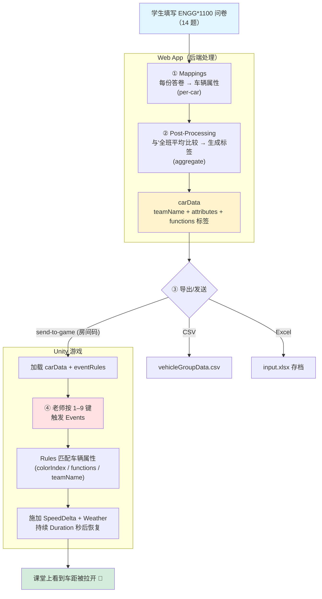

# ENGG*1100 Survey — 老师/助教操作指南

> **面向对象**：课堂操作者（老师、助教）
> **用途**：用 ENGG\*1100 问卷模板收集团队数据，导入赛车游戏，在课堂上实时触发事件、呈现"系统性差异"教学主题。
> **数据/算法真相来源**：`web-app/src/seed-templates.js`（模板定义）、`web-app/src/routes/export.js`（映射与后处理）、`design/gdd/event-system.md`（规则引擎）。

---

## 0. 一分钟速览

ENGG\*1100 Survey 复刻原始 ENGG\*1100 MS Forms 问卷。学生填写团队问卷后，系统按固定管线把答卷转换成每辆赛车的**属性 + 标签**；你在比赛中**按键盘 1–9** 触发"事件（案件）"，事件依据车辆属性施加**限时加速/减速 + 天气特效**，让抽象的差异变成赛道上肉眼可见的车距。

**你的操作只有三步：**
1. 让学生填问卷（分享链接）。
2. 在 Dashboard 把数据发送/导出到游戏房间。
3. 比赛中按 1–7 键触发事件，配合口播讲解。

---

## 1. 数据管线全景（Mermaid）

---

## 2. 按键速查表（比赛中随手可查）⭐

| 按键 | 事件名（案件） | 命中谁 | 效果 | 时长 | 天气 | 可重复 |
|:---:|---|---|:---:|:---:|:---:|:---:|
| **1** | Name Length Penalty | 队名长度 > 10 字符的队 | **−10 m/s** ⬇ | 8s | — | ✗ |
| **2** | Color Boost (Blue) | 选**蓝色**的队 | **+15 m/s** ⬆ | 6s | — | ✗ |
| **3** | Color Penalty (Red) | 选**红色**的队 | **−12 m/s** ⬇ | 8s | — | ✗ |
| **4** | Function Boost (Password) | 带 `password` 标签的队 | **+10 m/s** ⬆ | 6s | — | ✗ |
| **5** | Function Penalty (Face Recog) | 带 `facerecog` 标签的队 | **−10 m/s** ⬇ | 8s | — | ✗ |
| **6** | Snow Weather ❄ | **所有队** | **−8 m/s** ⬇ | 12s | 雪 | ✓ |
| **7** | Night Weather 🌙 | **所有队** | **−5 m/s** ⬇ | 15s | 夜 | ✓ |

> **重要提示**
> - 1–5 号事件**一局只能触发一次**（`AllowRepeat=false`）；6、7 号天气事件**可反复触发**。
> - 多个事件的速度增减**叠加**、各自独立计时。例：先按 6（雪 −8）再按 5（人脸 −10），命中的队净减 **−18 m/s**。
> - 触发无命中车辆时会记录"0/总数 cars affected"，属正常。

**建议课堂节奏**（配合口播）：
`2 蓝色加速` → `3 红色减速`（讲颜色的随意性如何变成结构性优势/劣势）→ `4 / 5 功能标签`（讲技术条件差异）→ `6 / 7 天气`（讲外部环境对所有人的不平等冲击）。

---

## 3. 问卷题目：哪些进游戏、哪些只作记录

问卷共 14 题，但**只有被 Mapping 引用的题目影响游戏数值**，其余仅用于问卷记录/导出 Excel。

### 3.1 进入游戏的题目（Mapping 表）

| 题目 | 车辆属性 | 转换 | 说明 |
|---|---|---|---|
| `team_name` 车队名 | `teamName` | *（固有身份，无需映射）* | 引擎特殊取值 |
| `color` 车队颜色 | `colorIndex` | **lookup** | Green=0, Black=1, Red=2, Blue=3, White=4 |
| `facial_count` 用人脸识别的人数 | `facial_count` | numeric | → 后处理 |
| `glasses_count` 戴眼镜/隐形的人数 | `glasses_count` | numeric | → 后处理 |
| `language_count` 团队会的语言总数 | `language_count` | numeric | → 后处理 |
| `male_count` 认同为男性的人数 | `male_count` | numeric | → 后处理 |
| `pwd_count` 密码≥5字符的人数 | `pwd_count` | numeric | → 后处理 |
| `distance_km` 最远成员家乡到 Guelph 的距离(km) | `distance_km` | numeric | → 后处理 |

### 3.2 仅作记录、不影响游戏的题目

`member_count`（成员数）、`member_names`（成员名，用于发奖）、`vehicle_type`（偏好车型）、`entertainment`（娱乐系统）、`driving_experience`（驾驶经验）、`car_features`（车载功能排序）。

> **转换方式含义**：**lookup** = 查表把文字换成代码值；**numeric** = 保留数字原值；查不到/非数字时回退到默认值。

---

## 4. 数值生产：标签是怎么算出来的（后处理）

这是 ENGG\*1100 模板的教学核心，复刻自原始 `DataTool.py`。它**不用绝对标准，而是拿每支队伍与"全班平均值"比较** —— 差异是相对同伴产生的。达标就贴一个标签，所有标签合并进 `functions` 属性（用 `/` 分隔，如 `facerecog/glasses/distance`）。

| 源属性 | 判定方向 | 生成标签 | 通俗解释 |
|---|:---:|---|---|
| facial_count | **≥ 全班平均** | `facerecog` | 用人脸识别的人数 ≥ 平均 |
| glasses_count | **≥ 全班平均** | `glasses` | 戴眼镜的人数 ≥ 平均 |
| language_count | **≥ 全班平均** | `language` | 会的语言数 ≥ 平均 |
| pwd_count | **≤ 全班平均** ⚠ | `password` | 用长密码的人数 **≤** 平均（即密码整体偏弱） |
| distance_km | **≥ 全班平均** | `distance` | 最远家乡距离 ≥ 平均 |
| male_count | **> 2（固定值）** | `male` | 男性成员数 **大于 2**（这条看固定值，不看平均） |

> ⚠ **`password` 方向是反的**（`≤ 平均`）：密码强度**低于**平均的队伍反而被贴 `password` 标签、随后在 4 号事件里 **+10** 加速。这是忠实复刻原始算法的行为，讲解时可作为"看似中性的数据如何被重新定义为优/劣势"的例子。

### 关键点：有 4 个标签"算了但默认没用" 🧩

后处理会生成 6 种标签，但内置 7 个事件**只用到 `password` 和 `facerecog`**。`glasses / language / distance / male` 会被算出并导出，但默认没有事件使用它们 —— 这是**留给你的扩展位**。若想启用，在 Dashboard 的 **Rules 编辑器**里新增事件即可，例如：

- `Language Barrier`：`functions` **Contains** `language` → −8 m/s
- `Distance Fatigue`：`functions` **Contains** `distance` → −6 m/s

---

## 5. 匹配引擎语义（新增/修改事件时需知）

| 运算符 (Operator) | 含义 |
|---|---|
| `Equals` / `NotEquals` | 字符串相等/不等（大小写不敏感） |
| `Contains` / `NotContains` | 属性含/不含某值；`/` 分隔的多标签逐段独立比对 |
| `GreaterThan` / `LessThan` | 数值大于/小于 |
| `LengthGreaterThan` / `LengthLessThan` | 比**字符串长度**（如队名字数） |
| `All` | 无视属性，命中所有车（用于天气/全局事件） |

- **teamName** 是车辆固有身份字段，引擎特殊取值，无需 Mapping。
- 事件支持 **AND/OR 复合条件**（多个子条件），本模板未用，但可自行添加（参考 `Accessibility` 模板的 "Intersectional Barrier" 复合条件示例）。
- **天气**可选：`None / Snow / Night / Sunset`，事件触发时激活对应 VFX。

---

## 6. 标准操作流程（SOP）

1. **收集**：在 Dashboard 打开 ENGG\*1100 Survey，通过 **Share** 面板把链接/二维码发给各队填写。
2. **核对**：在 **Responses** 标签页确认各队已提交；用 **Results** 标签页预览映射后的属性与标签。
3. **发送到游戏**：
   - 让 Unity 端进入房间、获取**房间码**；
   - 在 Dashboard 用 **Send to Game**（输入房间码）直接推送 `carData + eventRules`；
   - 或先 **Export CSV/Excel** 存档再手动导入。
   - 收到 `carsCount / rulesCount` 回执即表示导入成功。
4. **开赛并触发事件**：按 **§2 按键速查表**触发案件，配合口播讲解教学点。
5. **复盘**：可导出 Excel 存档，或用于赛后发奖（`member_names` 题）。

---

## 7. 常见问题（FAQ）

| 现象 | 说明 / 处理 |
|---|---|
| 按了某个键但没有车受影响 | 该案件当前无匹配车辆（如无队伍带对应标签），日志显示 "0/N"，正常。 |
| 同一个案件按第二次没反应 | 1–5 号事件不可重复（一局一次）；只有 6、7 号天气可重复。 |
| 改了 `seed-templates.js` 默认模板但没生效 | 种子用 `INSERT OR IGNORE` 按模板名去重，已存在则不覆盖。需改模板名或重置数据库，或直接在 UI 里编辑当前问卷。 |
| 想启用 `glasses/language/distance/male` 标签 | 在 Rules 编辑器新增 `Contains` 事件（见 §4 末）。 |
| 发送到游戏报 "No responses to send" | 还没有学生提交问卷，先分享收集数据。 |

---

## 8. 一句话总结

> 学生答案先按 **Mapping** 变成车的颜色代码和一组数字，再通过 **平均阈值后处理**与"全班平均"比较、贴上 `functions` 标签；游戏里你按 **1–9 键**触发 **Events**，事件按 `colorIndex / functions / teamName` 匹配车辆并施加限时的加速、减速与天气 —— 把抽象的"系统性差异"变成赛道上看得见的车距。
